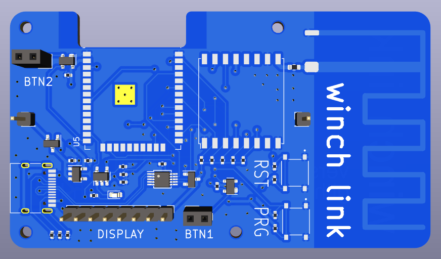

# winch-link

This is a new project and intended to facilitate communication when launching a paraglider with a winch, as the usual communication via radio often causes problems.

This requires one device for the launch leader and one for the winch.
"winch link" is to transmit the different states like "pilot ready to launch", "pilot hooked in", "tighten rope" etc. to the winch by pressing a button. The winch operator can set his device to confirm automatically or by pressing a button.

Currently the device is under development (See [hardware/winch-link](hardware/winch-link)). The circuit board is drawn and the first prototypes will be ordered in the next weeks. The device will be equipped with an e-paper display so that it can be read in direct sunlight. 

## MIT License

Copyright (c) [2023] [Martin Petri]

Permission is hereby granted, free of charge, to any person obtaining a copy
of this software and associated documentation files (the "Software"), to deal
in the Software without restriction, including without limitation the rights
to use, copy, modify, merge, publish, distribute, sublicense, and/or sell
copies of the Software, and to permit persons to whom the Software is
furnished to do so, subject to the following conditions:

The above copyright notice and this permission notice shall be included in all
copies or substantial portions of the Software.

THE SOFTWARE IS PROVIDED "AS IS", WITHOUT WARRANTY OF ANY KIND, EXPRESS OR
IMPLIED, INCLUDING BUT NOT LIMITED TO THE WARRANTIES OF MERCHANTABILITY,
FITNESS FOR A PARTICULAR PURPOSE AND NONINFRINGEMENT. IN NO EVENT SHALL THE
AUTHORS OR COPYRIGHT HOLDERS BE LIABLE FOR ANY CLAIM, DAMAGES OR OTHER
LIABILITY, WHETHER IN AN ACTION OF CONTRACT, TORT OR OTHERWISE, ARISING FROM,
OUT OF OR IN CONNECTION WITH THE SOFTWARE OR THE USE OR OTHER DEALINGS IN THE
SOFTWARE.